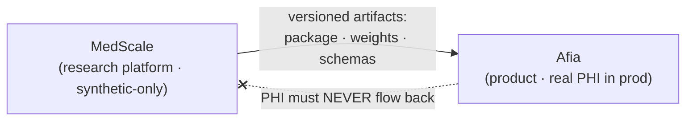

<!-- markdownlint-disable MD033 MD041 -->
<div align="center">

# MedScale

**Open research intelligence infrastructure for medicine.**

*Verifiable clinical AI and verified evidence — FHIR-native · grammar-constrained · validator-grounded · deterministic · reproducible*

[](https://github.com/IamShehri/MedScale/actions/workflows/ci.yml)
[](LICENSE)
[](pyproject.toml)
[-orange.svg)](docs/vision/MEDSCALE_STRATEGIC_BLUEPRINT_V1.md)

</div>

---

## What MedScale is

MedScale builds systems whose clinical outputs can be **checked mechanically** —
against FHIR StructureDefinitions, against terminology value sets, and against
executable queries — rather than merely *judged plausibly*. The organizing bet is that
in medicine, **verifiable form and traceable content are worth more than fluent prose
that cannot be checked.**

The platform is built around five ideas:

| Idea | Meaning |
|---|---|
| **FHIR-native** | FHIR is a first-class reasoning representation, not an afterthought. |
| **Grammar-constrained generation** | Decoding against FHIR grammars guarantees structural validity *for free*. |
| **Validator-grounded verification** | The HL7 validator is the ground truth — an exact, scalable oracle. |
| **Deterministic benchmarking** | Every headline metric is executable; **no LLM-as-judge** in any primary metric. |
| **Reproducible research** | No claim without a script and a committed artifact; negative results are first-class. |

The guiding scientific hypothesis: **grammar guarantees form; training only teaches
content.** It is designed to be *falsified, not assumed.*

MedScale has two pillars on one verification spine
([ADR-0005](docs/adr/0005-research-intelligence-scope.md)): **verifiable clinical
generation** (FHIR, grammar, validator, benchmark) and **verified evidence
infrastructure** (litdb + the evidence model,
[ADR-0009](docs/adr/0009-evidence-model.md)). It is infrastructure — not a medical
chatbot, and not a clinician-facing answer product.

> MedScale is **not** a from-scratch foundation model, **not** a medical device, and is
> **never** trained or evaluated on PHI. See
> [What MedScale is / is not](docs/vision/MEDSCALE_RESEARCH_VISION.md).

## MedScale and Afia

MedScale is an independent research platform. A separate product, **Afia**, consumes it.
The dependency is strict and one-way:



**Afia depends on MedScale. MedScale must never depend on Afia.** Formalized in
[ADR-0003](docs/adr/0003-repository-topology.md).

## Status

**Pre-research foundation (T0).** The scientific strategy is frozen; the engineering
foundation is being established. No model training, benchmark, or FHIR toolkit is
implemented yet — by design. See the [Roadmap](ROADMAP.md).

The public API currently exposes only reproducibility primitives; domain APIs (FHIR,
grammar, validation, benchmark, model) arrive in their own phases.

## Repository map

| Path | Contents |
|---|---|
| [`docs/vision/`](docs/vision/) | Strategic Blueprint (canonical narrative) + Research Vision (canonical scope) |
| [`docs/research/`](docs/research/) | Research questions, paper taxonomy, reproducibility policy |
| [`docs/governance/`](docs/governance/) | Program rules (R1–R7), policies |
| [`docs/adr/`](docs/adr/) | Architecture Decision Records |
| [`docs/execution/`](docs/execution/) | Phase (T0–T7) planning; fills as work proceeds |
| [`docs/archive/`](docs/archive/) | Superseded material (kept for history) |
| [`src/medscale/`](src/medscale/) | The `medscale` Python package |
| [`tests/`](tests/) | Test suite |

Start with the [Documentation Index](docs/README.md) and the
[Glossary](docs/glossary.md).

## Quickstart (development)

MedScale uses [uv](https://docs.astral.sh/uv/) and Python 3.11.

```bash
git clone https://github.com/IamShehri/MedScale
cd MedScale
uv sync                        # create .venv and install dev tooling
uv run pytest                  # run the test suite
uv run ruff check .            # lint
uv run mypy                    # strict type-check
```

See the [Developer Guide](docs/guides/developer_guide.md) for the full workflow.

## Contributing

MedScale welcomes contributors under its reproducibility and citation policies. Please
read [CONTRIBUTING](CONTRIBUTING.md), the [Code of Conduct](CODE_OF_CONDUCT.md), and the
[program rules R1–R7](docs/governance/rules.md) before opening a pull request.

## Citing MedScale

If you use MedScale in academic work, please cite it — see [CITATION.cff](CITATION.cff).

## License

[Apache-2.0](LICENSE). Everything MedScale ships is chosen to permit derivative models
and commercial use, so that Afia — and others — may build on it.
