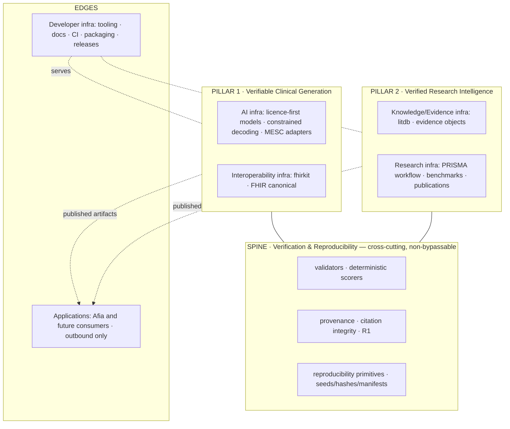

# ADR-0012 — The MedScale Layered Architecture Model

- **Status:** Proposed (awaiting operator approval — this reconciles a founder-proposed
  architectural framing with the accepted reference architecture; not self-ratified)
- **Date:** 2026-07-10
- **Deciders:** Operator (solo founder)
- **Supersedes:** none (refines, does not replace, the
  [reference architecture](../architecture/medscale_reference_architecture.md))
- **Superseded by:** none
- **Related:** [ADR-0005](0005-research-intelligence-scope.md) (two pillars),
  [ADR-0006](0006-model-access-strategy.md) (model registry),
  [ADR-0010](0010-release-architecture.md) (distribution),
  [reference architecture](../architecture/medscale_reference_architecture.md)

## Context

A founder directive proposes an eight-layer mental model for MedScale (Knowledge,
Evidence, Verification, Interoperability, AI, Research, Developer, Applications) and asks
that every component "fit naturally into one of these layers." This is a valuable
communication and onboarding device — a decade-scale, hundred-contributor project needs a
shared vocabulary for where things live. But two of its properties conflict with the
accepted architecture and the core thesis, so it cannot be adopted verbatim.

**Concern 1 — it demotes verification to a peer layer.** The proposal lists "Verification
Infrastructure" as layer 3, one peer among eight. MedScale's entire differentiation is
that verification is *not* a layer you can bypass — it is the spine every other layer's
output must pass through (reference architecture, "the correction that matters"). A model
in which verification sits beside AI and Interoperability as an optional-feeling peer
describes any healthcare-AI platform, including the closed products MedScale exists to
differentiate from. Adopting that framing would quietly weaken the thesis in the very
document meant to communicate it.

**Concern 2 — three of the layers overlap.** "Knowledge," "Evidence," and "Research"
infrastructure are, in MedScale's concrete design, the same pillar: litdb + evidence
objects + reproducible research workflow (pillar 2, ADR-0005). Eight labels for what is
architecturally two pillars plus a spine invites boundary disputes and duplicated docs —
the opposite of the clarity the layering is meant to provide.

**What the proposal gets right:** it names two things the current reference architecture
underweights — **Developer Infrastructure** (the contributor-facing surface: tooling,
docs, CI, packaging) and **Applications** (Afia as *one* consumer among future many).
Both deserve first-class naming.

## Decision (proposed)

Adopt a **reconciled layered model**: a cross-cutting spine plus two pillars plus two
edges, with the eight proposed labels retained as a *navigational taxonomy* that maps
onto this structure (so the founder's vocabulary works, without demoting verification).

**Label mapping (the founder's 8 layers → this model):**

| Proposed layer | Maps to | Note |
|---|---|---|
| Verification | **The spine** (not a layer) | Elevated, not demoted — the one structural change from the proposal |
| Knowledge + Evidence + Research | **Pillar 2** (Research Intelligence) | Three labels, one pillar (ADR-0005) |
| AI | Pillar 1 · model sublayer | Licence-first (ADR-0006); models are replaceable, the spine is not |
| Interoperability | Pillar 1 · FHIR sublayer | FHIR supports, does not define (ADR-0008) |
| Developer | **Edge: Developer Infrastructure** | Newly first-class (see below) |
| Applications | **Edge: Applications** | Afia is one consumer; outbound-only (ADR-0003) |

**Horizon classification of each element** (never implement Horizon 3 during Horizon 1):

| Element | Horizon | Basis |
|---|---|---|
| Spine (repro primitives, provenance) | **H1 — now** | Exists (T0); grows at T2/T3 |
| Pillar 2 litdb/evidence | **H1 — now** | T1 in progress |
| Pillar 1 fhirkit | H1→H2 boundary | T2, gated on JRE/validator |
| Pillar 1 models/MESC | H2 design, H2 build | T4–T6; no training before the gate |
| Developer infrastructure | **H1 — now** | Tooling/docs/CI/releases already live; strengthen continuously |
| Knowledge graph, research agents | **H3 — document only** | ADR-0005 gates; not built in H1 |
| Applications (beyond Afia) | H3 — document only | Consumers, not MedScale scope |

**Developer Infrastructure is elevated to a first-class edge.** Rationale drawn from the
ecosystem the directive cites: the projects that became reference infrastructure won on
*contributor experience and trust*, not features — PyTorch (developer adoption),
Hugging Face (frictionless distribution), PostgreSQL (reliability + docs), Linux
(community + governance), Kubernetes (extensibility), MLflow (reproducible experiment
tracking). MedScale's contributor surface (typed package, strict gate, discoverable docs,
release process) is therefore infrastructure to be invested in deliberately, not a
byproduct. This does not add scope; it names and protects work already underway.

## Consequences

**Positive:** the founder's layering vocabulary is usable for onboarding and docs without
weakening the verification thesis; overlap between Knowledge/Evidence/Research is resolved
into one pillar; Developer and Applications become nameable; every component now has a
horizon label, making "not now" decisions legible to future contributors without founder
memory.

**Negative / costs:** one more architectural document to keep consistent with the
reference architecture (mitigated: this ADR refines rather than forks it; the reference
architecture gains a one-line pointer here); the taxonomy must be applied consistently in
future docs or it decays.

## Alternatives considered

- **Adopt the 8-layer model verbatim.** Rejected: demotes verification to a peer layer
  (Concern 1) and triple-counts pillar 2 (Concern 2) — it would weaken the thesis in the
  act of documenting it.
- **Keep the existing spine+layers reference architecture unchanged.** Rejected: it
  underweights Developer Infrastructure and Applications, both of which the decade-scale
  goal needs named and protected.
- **Replace the reference architecture entirely.** Rejected: unnecessary churn; the spine
  model is correct and accepted — this refines its vocabulary, nothing more.

## Compliance

On acceptance: add a pointer from the
[reference architecture](../architecture/medscale_reference_architecture.md) to this
ADR's taxonomy; use the spine/pillars/edges + horizon labels as the standard vocabulary in
future architecture docs. No code changes; no new packages; the model registry remains a
documentation artifact under ADR-0006 ([model strategy](../architecture/ai_model_strategy.md)).
