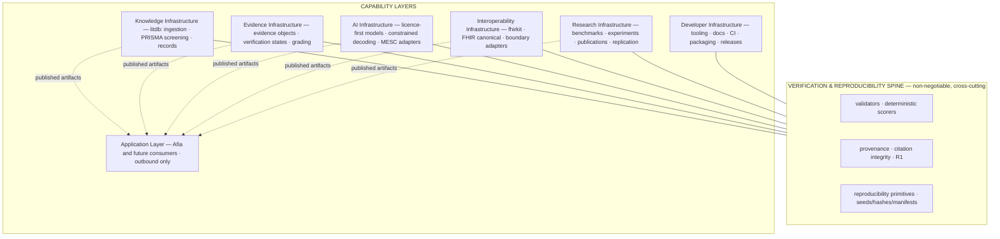

# ADR-0012 — The MedScale Layered Architecture Model (Hybrid: Spine + Capability Layers)

- **Status:** Accepted (2026-07-10, operator approval with refinement — see Acceptance notes)
- **Date:** 2026-07-10
- **Deciders:** Operator (solo founder)
- **Supersedes:** none (refines, does not replace, the
  [reference architecture](../architecture/medscale_reference_architecture.md))
- **Superseded by:** none
- **Related:** [ADR-0005](0005-research-intelligence-scope.md) (two pillars),
  [ADR-0006](0006-model-access-strategy.md) (model registry),
  [ADR-0010](0010-release-architecture.md) (distribution),
  [reference architecture](../architecture/medscale_reference_architecture.md)

## Context

A founder directive proposes an eight-layer mental model for MedScale (Knowledge,
Evidence, Verification, Interoperability, AI, Research, Developer, Applications) and asks
that every component "fit naturally into one of these layers." This is a valuable
communication and onboarding device — a decade-scale, hundred-contributor project needs a
shared vocabulary for where things live. But two of its properties conflict with the
accepted architecture and the core thesis, so it cannot be adopted verbatim.

**Concern 1 — it demotes verification to a peer layer.** The proposal lists "Verification
Infrastructure" as layer 3, one peer among eight. MedScale's entire differentiation is
that verification is *not* a layer you can bypass — it is the spine every other layer's
output must pass through (reference architecture, "the correction that matters"). A model
in which verification sits beside AI and Interoperability as an optional-feeling peer
describes any healthcare-AI platform, including the closed products MedScale exists to
differentiate from. Adopting that framing would quietly weaken the thesis in the very
document meant to communicate it.

**Concern 2 — three of the layers overlap.** "Knowledge," "Evidence," and "Research"
infrastructure are, in MedScale's concrete design, the same pillar: litdb + evidence
objects + reproducible research workflow (pillar 2, ADR-0005). Eight labels for what is
architecturally two pillars plus a spine invites boundary disputes and duplicated docs —
the opposite of the clarity the layering is meant to provide.

**What the proposal gets right:** it names two things the current reference architecture
underweights — **Developer Infrastructure** (the contributor-facing surface: tooling,
docs, CI, packaging) and **Applications** (Afia as *one* consumer among future many).
Both deserve first-class naming.

## Decision (accepted, as refined by the operator)

Adopt a **hybrid architecture**: a non-negotiable, cross-cutting **Verification &
Reproducibility Spine**, plus **seven capability layers**. Verification is never a peer
capability layer, because it is the defining identity of MedScale — every capability
layer's output is admissible only after passing the spine.

**Layer definitions and anchors:**

| Capability layer | Owns | Anchor decisions |
|---|---|---|
| Knowledge Infrastructure | Literature ingestion, PRISMA screening, bibliographic records | T1; ADR-0005 |
| Evidence Infrastructure | Evidence objects, verification states, provenance-graded claims | ADR-0009 |
| AI Infrastructure | Model registry, constrained decoding, MESC adapters | ADR-0006; models are replaceable, the spine is not |
| Interoperability Infrastructure | fhirkit, FHIR-canonical representation, boundary adapters | ADR-0008; FHIR supports, does not define |
| Research Infrastructure | Benchmarks, experiment manifests, papers, replication packages | ADR-0010/0011 (releases) |
| Developer Infrastructure | Tooling, docs, CI, packaging, release automation | First-class (see rationale below) |
| Application Layer | Afia and every future consumer; consumes released artifacts only | ADR-0003; outbound-only, PHI never returns |

The two *pillars* of ADR-0005 (verifiable clinical generation; verified research
intelligence) remain the **mission grouping** of these layers: pillar 1 ≈ AI +
Interoperability; pillar 2 ≈ Knowledge + Evidence + Research. Layers say *where code
and docs live*; pillars say *why they exist*. Both vocabularies are canonical, and they
do not conflict.

**Horizon classification of each element** (never implement Horizon 3 during Horizon 1):

| Element | Horizon | Basis |
|---|---|---|
| Spine (repro primitives, provenance) | **H1 — now** | Exists (T0); grows at T2/T3 |
| Knowledge + Evidence Infrastructure (litdb, evidence objects) | **H1 — now** | T1 in progress |
| Interoperability Infrastructure (fhirkit) | H1→H2 boundary | T2, gated on JRE/validator |
| AI Infrastructure (models/MESC) | H2 design, H2 build | T4–T6; no training before the gate |
| Research Infrastructure (benchmarks, publications) | H1 design, H2+ scale | T3 onward |
| Developer Infrastructure | **H1 — now** | Tooling/docs/CI/releases already live; strengthen continuously |
| Knowledge graph, research agents (within Knowledge/Research layers) | **H3 — document only** | ADR-0005 gates; not built in H1 |
| Application Layer beyond Afia | H3 — document only | Consumers, not MedScale scope |

**Developer Infrastructure is elevated to a first-class edge.** Rationale drawn from the
ecosystem the directive cites: the projects that became reference infrastructure won on
*contributor experience and trust*, not features — PyTorch (developer adoption),
Hugging Face (frictionless distribution), PostgreSQL (reliability + docs), Linux
(community + governance), Kubernetes (extensibility), MLflow (reproducible experiment
tracking). MedScale's contributor surface (typed package, strict gate, discoverable docs,
release process) is therefore infrastructure to be invested in deliberately, not a
byproduct. This does not add scope; it names and protects work already underway.

## Consequences

**Positive:** the layered vocabulary is usable for onboarding and docs without weakening
the verification thesis (the spine is structurally outside the layer list); Knowledge and
Evidence keep distinct names while the pillar grouping preserves their mission unity;
Developer Infrastructure and the Application Layer become nameable; every component has a
horizon label, making "not now" decisions legible to future contributors without founder
memory.

**Negative / costs:** one more architectural document to keep consistent with the
reference architecture (mitigated: this ADR refines rather than forks it; the reference
architecture gains a one-line pointer here); the taxonomy must be applied consistently in
future docs or it decays.

## Alternatives considered

- **Adopt the 8-layer model with verification as layer 3.** Rejected (and this is the
  refinement the operator confirmed): demoting verification to a peer capability layer
  would weaken MedScale's defining identity in the very document meant to communicate it.
  Verification is the spine, structurally outside the layer list.
- **Collapse Knowledge/Evidence/Research into a single "pillar 2" layer.** Considered in
  the original draft; **not adopted** — the operator kept Knowledge, Evidence, and
  Research as distinct capability layers for clarity, with the ADR-0005 pillars retained
  as the cross-layer mission grouping.
- **Replace the reference architecture entirely.** Rejected: unnecessary churn; the spine
  model is correct and accepted — this refines its vocabulary, nothing more.

## Compliance

On acceptance: add a pointer from the
[reference architecture](../architecture/medscale_reference_architecture.md) to this
ADR's taxonomy; use the spine + capability-layer + horizon vocabulary as the standard in
future architecture docs. No code changes; no new packages; the model registry remains a
documentation artifact under ADR-0006 ([model registry](../models/model_registry.md)).

## Acceptance notes (operator refinement, 2026-07-10)

The operator approved the direction with one refinement: **do not remove the layered
model.** The adopted structure is the hybrid above — the non-negotiable Verification &
Reproducibility Spine (cross-cutting, applying to every component) plus seven capability
layers: Knowledge, Evidence, AI, Interoperability, Research, Developer, and Application
(Afia and future consumers). Knowledge and Evidence remain *distinct layers* (rather than
collapsed into one pillar label, as originally proposed here); the ADR-0005 pillars are
retained as the mission grouping across layers. The original proposal's core correction
stands verbatim: **verification must never be treated as a peer capability layer, because
it is the defining identity of MedScale.**
