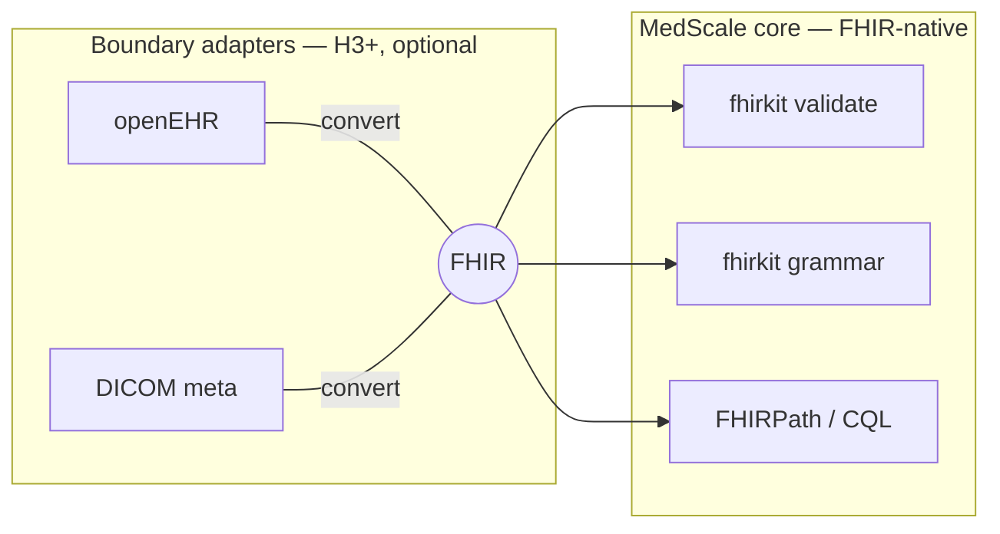

# Interoperability Strategy

- **Status:** Strategy (governed by [ADR-0008](../adr/0008-interoperability-fhir-canonical.md), Proposed)
- **Date:** 2026-07-10
- **Related:** [ecosystem analysis §3–4](ecosystem_analysis.md#3-fhir-and-the-ehr-functional-model),
  [ADR-0003](../adr/0003-repository-topology.md), [RQ7](../research/research_questions.md)

## The single-representation rule

**FHIR is MedScale's one canonical clinical representation.** Every internal artifact —
grammars, validators, benchmark tasks, training data, knowledge extraction — speaks FHIR.
Other standards reach MedScale only through **boundary adapters** that convert to/from
FHIR at the edge. The platform never carries a second clinical model internally: a
dual-model core doubles every validator, grammar, and benchmark task and destroys the
"one executable definition of correctness" property the whole program rests on.

## FHIR scope (T2 `medscale.fhirkit` — architecture unchanged, boundaries sharpened)

| In scope | Out of scope |
|---|---|
| Resource/profile validation (HL7 validator, pinned + checksummed) | EHR *system* functionality (EHR-FM: workflow, business rules, audit infrastructure) |
| StructureDefinition → decoding grammar | Hospital integration engines / messaging middleware |
| FHIRPath query + repair | Operating a FHIR server as a product |
| Note↔bundle transformation (bench tasks) | Real-EHR connectivity (that is Afia's side of the boundary, with real PHI — R2) |
| Terminology *interface* (RQ7; SNOMED licence-gated, never vendored) | Vendoring restricted terminologies |

The EHR Functional Model (build.fhir.org/ehr-fm.html) is useful precisely as a *negative
map*: it enumerates the EHR-system surface MedScale must not wander into.

**CQL** is acknowledged as the standards-track language for executable clinical logic —
a natural *future* extension of "executable ground truth" beyond FHIRPath — but it is
**not** in fhirkit v0. Revisit only when a benchmark task genuinely needs it (evidence
before implementation).

## openEHR (and DICOM): the adapter pattern, deferred

The Cistec `openEHR2FHIRquestionnaire` utility (MIT) is the existence proof: openEHR
web templates convert to FHIR Questionnaires at the boundary, in ~one small Python
module. That is the *pattern* MedScale adopts **if and when** Horizon 3 demand exists:

- an optional `medscale[openehr]` adapter, interface owned by MedScale;
- conversion at ingestion/egress only; everything internal remains FHIR;
- outputs pass fhirkit validation like any other FHIR — adapters get no trust.

Until then: **no openEHR code, no openEHR dependency.** Same for DICOM (further out;
only ever metadata-level, and only behind an executable ground truth).

## Hospital integration

MedScale ships artifacts (package, weights, schemas); **Afia and other consumers do
hospital integration.** The consumption contract (ADR-0003) already encodes this: models
and schemas flow outward; clinical data never flows in.
