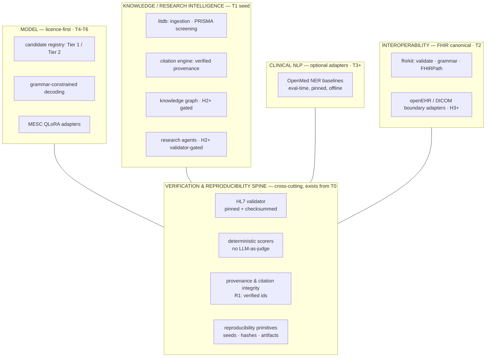

# MedScale Reference Architecture

- **Status:** Proposed target architecture (conceptual; implementation gated phase by phase)
- **Date:** 2026-07-10
- **Related:** [ecosystem analysis](ecosystem_analysis.md), ADRs
  [0005](../adr/0005-research-intelligence-scope.md)–[0008](../adr/0008-interoperability-fhir-canonical.md),
  [Strategic Blueprint §7](../vision/MEDSCALE_STRATEGIC_BLUEPRINT_V1.md),
  [ADR-0004](../adr/0004-t0-foundation-scope.md)

## The correction that matters

The proposed four-layer architecture (AI / Knowledge / Clinical / Interoperability) was
evaluated and **amended in one fundamental way: it omitted verification.** A MedScale
architecture whose layers are models, knowledge, NLP, and interop — with no validator,
no deterministic scorers, no provenance spine — describes *any* healthcare-AI platform,
including the closed products MedScale differentiates against. Verification is not a
feature of one layer; it is the spine every layer is checked against. The reference
architecture below makes that explicit.

## Target architecture (conceptual, horizon-annotated)

Reading rules: solid boxes are committed Horizon-1 work mapped to existing phases;
`H2+`/`H3+` boxes are **directional and gated** — drawn so ambition is visible, labeled
so it cannot masquerade as scope. Every layer's outputs are admissible only after
passing the spine.

> **Navigational taxonomy:** [ADR-0012](../adr/0012-layered-architecture-model.md) refines
> this into a shared vocabulary (spine · two pillars · Developer/Applications edges) with a
> horizon label per element, reconciling a proposed 8-layer model while keeping
> verification cross-cutting rather than a peer layer.

## Layer-by-layer disposition

| Layer | What it is | Status / gate |
|---|---|---|
| Verification spine | Validator, deterministic scorers, citation provenance, repro primitives | **The identity.** Partially live (T0 primitives); grows at T2/T3 |
| Model | Licence-first registry → constrained decoding → adapters | T4–T6 as planned; no training before the T5 gate ([model strategy](ai_model_strategy.md)) |
| Knowledge / research intelligence | litdb + citation engine now; KG + agents later | T1 builds litdb **as a reusable capability**, not throwaway tooling — see ADR-0005 |
| Clinical NLP | OpenMed as optional eval-time adapter | T3/T7, extras group ([OpenMed strategy](openmed_integration_strategy.md)) |
| Interoperability | FHIR canonical; boundary adapters at the edge | T2 fhirkit; openEHR/DICOM H3+ ([interop strategy](interoperability_strategy.md)) |

Package consequence (ADR-0004 unchanged): all of this lives *inside* `medscale.*` as
subpackages added when their phase arrives (`medscale.litdb`, `medscale.fhirkit`,
`medscale.bench`, …). No new top-level packages.

## Data sources (future ingestion targets — knowledge layer)

Licence-gated per R3; nothing is ingested until its terms are recorded. All access via
documented public APIs with raw responses archived (R1 audit trail).

| Source | Role | Access path | Licence note |
|---|---|---|---|
| PubMed / MEDLINE | Bibliographic backbone | NCBI E-utilities | Metadata redistribution constraints — record per-field policy |
| PMC Open Access subset | Full text | PMC OA API/bulk | **OA subset only** (CC-BY family); never the full corpus |
| ClinicalTrials.gov | Trials registry | API v2 | US-gov open |
| openFDA | Drug labels, adverse events | openFDA API | US-gov open |
| WHO (ICTRP, GHO) | Global trials + health data | WHO APIs | Check per-dataset terms |
| NICE / Cochrane | Guidelines, systematic reviews | — | **Restricted**; metadata/linking only unless licensed — likely partner-tier, not ingest-tier |
| Semantic Scholar / OpenAlex / arXiv | Citation graph + preprints | Public APIs | Open; already the R1 verification backbone |

**Ingestion strategy:** T1 builds one narrow, PRISMA-governed pipeline
(query → fetch → dedupe → screen → extract), byte-reproducible from committed
queries + timestamps. Breadth (openFDA, trials, guidelines) is Horizon-2, added source
by source with a licence record each time — never a crawler.

**Metadata model:** the litdb schema *is* the metadata model — every record carries a
resolvable id (DOI/PMID/arXiv/S2), `verified_at`, `source_api`, licence, screening
state, and the taxonomy facets. **Citation tracking** = the R1 discipline made
infrastructure: identifiers first, content second, provenance always.

## Knowledge graph (evaluated, gated — not started)

The proposed schema (Disease, Drug, Gene, Study, Trial, Paper, Author, Institution,
Outcome; `Drug→treats→Disease`, `Paper→studies→Drug`, `Trial→evaluates→Intervention`) is
reasonable — and building it *now* would repeat a classic failure: hand-curated medical
KGs decay and unverifiable edges are liabilities. MedScale's rule: **an edge is a claim,
and claims need provenance.** Every edge must carry (source id, extraction method,
`verified_at`) and be recomputable from committed artifacts.

- **Gate to open KG work (H2):** litdb populated (T1) + deterministic extraction
  machinery proven on FHIR tasks (T3/T7). The KG then starts as *derived views over
  litdb + structured registries* (trials, labels — already-structured edges), not as
  free-text relation mining.
- Entity identity reuses existing ontologies where licences permit (MeSH, RxNorm,
  MONDO/DOID) — integration over reinvention; SNOMED stays interface-only.

## What this architecture refuses to become

- An answer-box product (that is the consumers' layer — Afia, or anyone).
- A dual-representation core (openEHR/DICOM live at the boundary).
- A model zoo (the registry is a filter, not a collection).
- An unverifiable KG (no provenance, no edge).
- An agent framework (agents arrive only when every step has an executable check).
