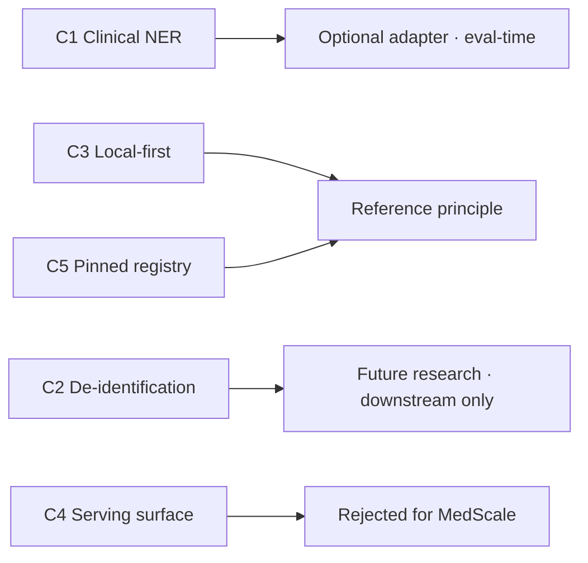

# OpenMed — Capability Analysis

- **Status:** Analysis (extends the accepted [ADR-0007](../adr/0007-openmed-adapter.md);
  introduces no new decision — the decision stands, this document decomposes it)
- **Date:** 2026-07-10
- **Related:** [OpenMed integration strategy](openmed_integration_strategy.md),
  [ecosystem analysis §1](ecosystem_analysis.md#1-openmed), Rules R2/R3, RQ5

The integration *strategy* answered "what role does OpenMed play?" (optional eval-time
adapter + reference architecture). This document answers the founder's sharper question:
**capability by capability, what does MedScale absorb, adapt, defer, or reject — and
why.** It absorbs *principles*, never products.

All facts verified against primary sources on 2026-07-10 (grey-tier evidence: citable
for facts, not performance claims).

## 1. Capability inventory (what OpenMed provides)

| # | Capability | Form | Licence |
|---|---|---|---|
| C1 | Clinical NER (diseases, drugs, chemicals, genes, anatomy, oncology) | ~1,511 encoder models, 110M–1B params | Apache-2.0 |
| C2 | PII detection & de-identification (18 HIPAA Safe-Harbor identifiers, 16 languages) | Token-classification models | Apache-2.0 |
| C3 | Local-first / on-device inference | PyTorch CPU/CUDA, Apple MLX, Transformers.js WebGPU | Apache-2.0 |
| C4 | Multi-surface serving | Python lib, REST API, Docker, iOS/macOS/Android SDKs | Apache-2.0 |
| C5 | Curated model registry with pinned revisions | HF Hub org (1,511+ models) | Apache-2.0 |

## 2. Value screen (which capabilities matter to MedScale — and which conflict)

| Capability | Valuable? | Conflicts with mission? |
|---|---|---|
| C1 Clinical NER | **Yes** — deterministic entity spans are exactly what RQ5 (T-EXTRACT hallucination scorer) and non-LLM extraction baselines need | No |
| C2 De-identification | Not for MedScale itself | **Yes, if adopted into core** — MedScale is synthetic-only (R2); there is no PHI to de-identify. Adopting de-id would invite the real-data workflows the PHI boundary forbids |
| C3 Local-first inference | **As a principle, yes** — offline, deterministic, reproducible evaluation aligns with the spine | No (as principle); yes if it pulls in a serving runtime |
| C4 Multi-surface serving | No | **Yes** — REST/Docker/mobile is product surface (Afia's layer), not research infrastructure |
| C5 Pinned-revision registry | **As a principle, yes** — pinning by revision + SHA is already MedScale's reproducibility rule | No |

## 3. Classification & disposition

### Adopted — optional adapter (C1 Clinical NER)

- **Why MedScale needs it.** The T-EXTRACT metric (RQ5) measures *faithfulness*: does
  every entity in a generated FHIR bundle have a supporting span in the source note?
  That requires entity spans. Rebuilding clinical NER from scratch would reinvent an
  excellent Apache-2.0 project (architecture rule: never rebuild what an excellent open
  project already solves).
- **What problem it solves.** Supplies span-extraction fixtures and a strong, cheap,
  **non-LLM baseline** for the extraction benchmark — the kind of honest baseline that
  makes a benchmark hard to game.
- **How it strengthens verification/reproducibility.** Encoder NER is deterministic per
  fixed weights; pinned by revision + SHA with spans precomputed into committed
  artifacts, it never introduces network or model nondeterminism into scoring. The
  *primary* metric stays model-free; any OpenMed-assisted variant is labeled secondary
  (no model-as-judge).
- **How it fits the architecture.** Behind a MedScale-owned `SpanExtractor` protocol, in
  an optional `medscale[openmed]` extras group, used only at T3/T7. `medscale` installs,
  tests, and benchmarks green with OpenMed absent.
- **Licensing.** Apache-2.0 → clean R3 pass; no passthrough on consumers.

### Adopted — reference principles (C3, C5)

Not code — design principles already consistent with the spine, now explicitly credited:
**offline/local-first evaluation** (no live model at benchmark time) and **pinned-revision
model registry** (revision + SHA, the reproducibility rule applied to third-party models).
MedScale keeps multi-backend serving *out* of the core, as OpenMed keeps it out of its
model definitions.

### Deferred — future research, downstream only (C2 De-identification)

De-identification is a valid *future* capability for healthcare deployment (ADR-0007
acceptance note), but it belongs to **consumers (Afia)**, not MedScale core. MedScale's
architecture merely stays *ready* (adapter protocols, extras groups, local-first design)
so de-id can be added later without core rework. It is never adopted into Horizon 1, and
never operates on real PHI inside MedScale.

### Rejected for MedScale (C4, and C2-as-core)

- **Serving surface (REST/Docker/mobile):** product scope; would import 500+ issues of
  application surface into research infrastructure.
- **De-identification as a core feature:** no PHI exists to de-identify (R2); adopting it
  would contradict the synthetic-only identity restated in every model card.
- **Hard dependency on OpenMed:** rejected in ADR-0007; the eval-time need never justifies
  coupling the platform to a fast-moving product repo.

## 4. Architecture lessons (from OpenMed's developer surface, verified 2026-07-10)

Studying *how* OpenMed is built — not to copy, but to learn:

| Observed in OpenMed | Lesson for MedScale |
|---|---|
| Composable **function-based API** (`analyze_text`, `deidentify`, `BatchProcessor`) over class-heavy pipelines | Prefer small, pure, composable functions with explicit inputs — MedScale's determinism story is easier to defend when the API is functions over data, not stateful pipelines |
| **Hierarchical model naming** (`OpenMed-NER-DiseaseDetect-BioMed-335M`) | A name should encode task + domain + size so users discover by capability. MedScale mirrors this: `mesc-fhir`, `mesc-evidence` (family + task) |
| **Local-first, "no telemetry, no license check-in, no outbound calls at runtime"** | The strongest trust signal OpenMed sends. MedScale must match it: no runtime phone-home, ever; evaluation runs offline from committed artifacts |
| **`OpenMedConfig.from_profile(dev/prod/test)`** | Environment-specific config is legitimate — but for MedScale, *reproducibility config* (seeds, pins) must be explicit inputs, not profile magic |
| **Backend proliferation** (MLX, Swift, Kotlin, FastAPI, WebGPU, SageMaker) | A warning, not a model: this breadth is *product* surface. MedScale keeps serving out of core; consumers (Afia) own deployment backends |
| **SemVer + Apache-2.0, no vendor lock-in** | Confirms MedScale's own release/licence choices (ADR-0010/0011) |
| **Use-case-organized docs** (quickstart → backend tutorials → API ref) | Documentation for non-engineers (clinical researchers) should lead with tasks, not modules — informs MedScale's guide structure |

## 5. Reusable principles (adopt principles, not implementations)

1. **Trust is a runtime property.** "No outbound calls at runtime" is a design constraint,
   not a footnote. MedScale adopts it as a hard rule for the model/eval path.
2. **Discoverability by capability.** Task-first naming and docs, so a clinical researcher
   finds what a thing *does* before what it *is*.
3. **Composition over pipelines.** Pure functions over data keep determinism auditable.
4. **Local-first, offline-reproducible.** The evaluation path must run from committed
   artifacts with no network — OpenMed proves this is viable at scale.
5. **Keep serving out of the research core.** Backend breadth belongs to consumers.

## 6. Principle absorbed, not product copied

The single transferable lesson is **"local-first, deterministic, pinned, discoverable"** —
most of which MedScale already holds as reproducibility policy, now sharpened by OpenMed's
worked example. MedScale takes OpenMed's *models* as an optional, pinned, offline baseline
and its *engineering stance* as confirmation and refinement of its own; it takes none of
OpenMed's product surface. That is the whole integration, and it does not change with any
future OpenMed release.
