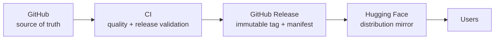

# Releases — Publication & Artifact Lifecycle

- **Status:** Strategy (governed by [ADR-0010](../adr/0010-release-architecture.md) and
  [ADR-0011](../adr/0011-versioning-licensing.md), both **Proposed**)
- **Date:** 2026-07-10

This section defines how every MedScale artifact is versioned, licensed, validated,
released, distributed, deprecated, and — if ever necessary — retracted. It exists so
that publication is a *governed pipeline*, not an event.

## The canonical flow (never the reverse)

- **GitHub is the only source of truth.** Every published artifact traces to a tag.
- **Hugging Face is distribution only.** Nothing originates there; nothing is edited
  there; a HF repo that drifts from its GitHub release is a defect.
- **CI is the only publisher.** Manual uploads (CLI, web UI) are prohibited; releases
  flow through tagged, operator-approved CI jobs ([ci_cd.md](ci_cd.md)).

## Principles

1. **Released = immutable.** A version, once published, never changes; fixes are new
   versions ([versioning.md](versioning.md)).
2. **No artifact without a manifest.** Every release carries the reproduction manifest
   ([reproducibility.md](reproducibility.md)).
3. **No artifact without a gate.** Each class has release criteria and a checklist
   ([release_process.md](release_process.md)); an artifact that fails its gate does not
   ship, whatever the calendar says.
4. **Licence before bytes** (Rule R3): licence review precedes publication, per field
   for datasets ([licensing.md](licensing.md)).
5. **Retraction is visible, not silent** — artifacts are marked and superseded, never
   deleted ([release_process.md §Retraction](release_process.md)).

## Documents

| Document | Covers |
|---|---|
| [artifact_lifecycle.md](artifact_lifecycle.md) | Every artifact class, its states and gates |
| [versioning.md](versioning.md) | Version schemes for package, models, datasets, benchmarks, schemas, docs, ADRs |
| [release_process.md](release_process.md) | The release procedure + all checklists (incl. deprecation, retraction) |
| [distribution.md](distribution.md) | GitHub Releases + the MedScaleAI Hugging Face organization |
| [licensing.md](licensing.md) | Per-artifact licensing matrix, inheritance, citation requirements |
| [model_cards.md](model_cards.md) | Required model-card content |
| [dataset_cards.md](dataset_cards.md) | Required dataset-card content |
| [benchmark_publication.md](benchmark_publication.md) | Benchmark spec, immutability, leaderboard policy |
| [papers.md](papers.md) | Research → paper → replication-package workflow |
| [reproducibility.md](reproducibility.md) | The release manifest every artifact must carry |
| [ci_cd.md](ci_cd.md) | Future GitHub Actions release automation (design only) |
