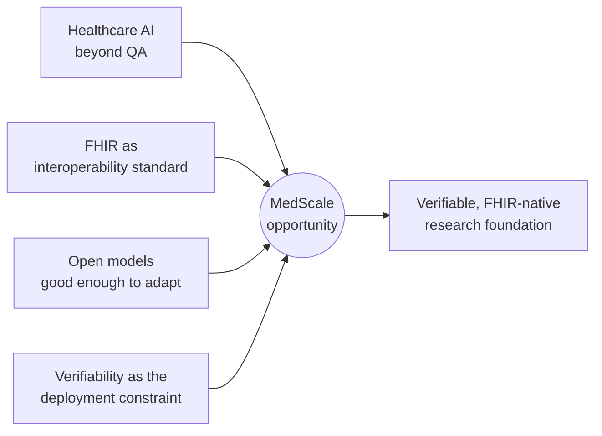
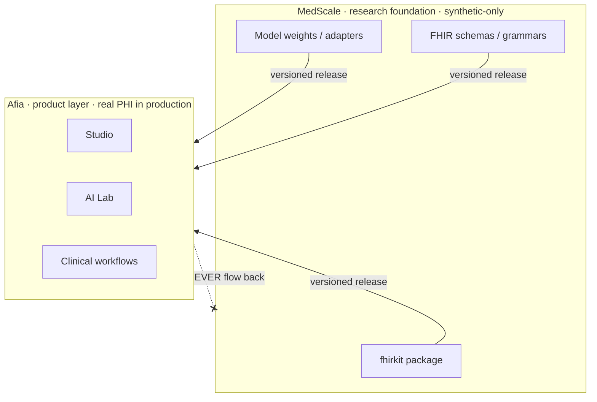
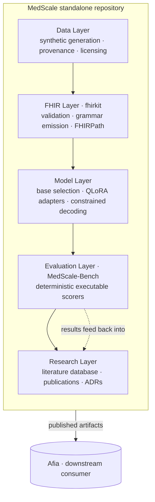
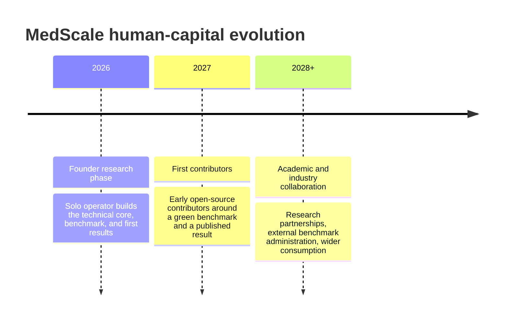
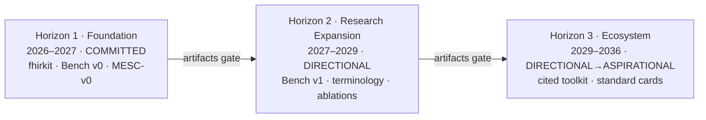

# MedScale Strategic Blueprint v1.0

> **The open research foundation powering verifiable healthcare intelligence.**

| Field | Value |
|---|---|
| **Horizon** | 2026–2036 |
| **Status** | Strategic Foundation Document |
| **Version** | 1.0 |
| **Date** | July 2026 |
| **Owner** | Operator (solo founder) |
| **Change control** | Amendments that expand scope, advance a horizon, or weaken the PHI boundary or the dependency direction require an Architecture Decision Record (ADR) and explicit operator approval. |

> This document is the founding constitution of MedScale. It sits at the top of the
> scope hierarchy: when a proposed piece of work cannot be traced to a research question
> and a horizon defined below, it is out of scope until this document is amended. It is
> intended for research collaborators, PhD researchers, open-source contributors, grant
> reviewers, future team members, and technical advisors.

---

## Table of Contents

1. [Executive Summary](#1-executive-summary)
2. [MedScale Identity](#2-medscale-identity)
3. [Why Now?](#3-why-now)
4. [MedScale and Afia Relationship](#4-medscale-and-afia-relationship)
5. [Research Vision](#5-research-vision)
6. [Scientific Research Program](#6-scientific-research-program)
7. [Technical Architecture](#7-technical-architecture)
8. [MedScale Benchmark Strategy](#8-medscale-benchmark-strategy)
9. [Dataset Philosophy](#9-dataset-philosophy)
10. [Model Strategy](#10-model-strategy)
11. [Literature Research Program](#11-literature-research-program)
12. [Publication Roadmap](#12-publication-roadmap)
13. [Open Source Strategy](#13-open-source-strategy)
14. [Community and Human Capital Roadmap](#14-community-and-human-capital-roadmap)
15. [Governance](#15-governance)
16. [Critical Risks](#16-critical-risks)
17. [10-Year Roadmap](#17-10-year-roadmap)
18. [Final Principles](#18-final-principles)

---

## 1. Executive Summary

MedScale is an open research foundation whose single organizing goal is to make clinical
AI **verifiable**. In medicine, fluent output that cannot be checked is a liability;
MedScale builds systems that produce healthcare data and reasoning whose correctness can
be *checked mechanically* — against FHIR StructureDefinitions, against terminology value
sets, and against executable queries — rather than merely *judged plausibly*.

The program rests on one load-bearing scientific hypothesis:

> **Grammar guarantees form; training only teaches content.**
>
> If grammar-constrained decoding against FHIR StructureDefinitions can guarantee
> structural validity essentially for free, then a small, inexpensive QLoRA adapter over
> an open base model need only learn *what to say*, not *how to shape it*. This is what
> makes a clinically useful FHIR-native model buildable on a solo founder's compute
> budget — and it is designed to be **falsified, not assumed**.

MedScale's crown deliverable is **MedScale-Bench**: a deterministic, executable, PHI-free
benchmark whose every headline metric is a validator output, an executed FHIRPath result,
or a set-F1 over structured triples — never an LLM-as-judge. Around it sit a
citation-verified literature database, synthetic-only datasets, a reproducible training
pipeline, trained adapters (the MESC model family), and honest publications that report
negative results as first-class outcomes.

MedScale is explicitly **the research foundation, not the product**. A separate product,
**Afia** (a healthcare operating system), consumes MedScale through published, versioned
artifacts. The dependency is strict and one-way: **Afia consumes MedScale; MedScale never
depends on Afia.**

The near-term commitment (Horizon 1, 2026–2027) is deliberately narrow and honest:
*a green benchmark, a published adapter or a published null result, and a reproducible
pipeline — all on Colab-class compute.* Everything beyond that is directional and gated on
evidence. This document records the full ten-year ambition precisely so that the near-term
work is not mistaken for the whole vision — and so the ambition is never mistaken for a
license to expand near-term scope.

---

## 2. MedScale Identity

### 2.1 What MedScale is

- A **FHIR-native clinical reasoning system** — QLoRA adapters over an open, permissively
  licensed base model; grammar-constrained decoding against FHIR StructureDefinitions; and
  a validation layer that adjudicates correctness.
- A **research engine** — a literature database, reproducible benchmarks (MedScale-Bench),
  synthetic datasets, trained adapters, and scientific publications.
- **FHIR intelligence** — structural, terminology, and profile validation; grammar
  emission; note↔bundle transformation; FHIRPath query and repair.
- An **open-source platform** — intended to be consumed by products (Afia first) and by
  the wider research community under a permissive licence.
- **Verification-first** — every claim is backed by a reproducible script and a committed
  result artifact; every headline metric is deterministic and executable.

### 2.2 What MedScale is not

- **NOT a from-scratch pretrained foundation model.** MedScale is adapters + constrained
  decoding + validation over an *existing* open base model. The phrase "from-scratch
  foundation model" is banned from MedScale documentation and communication.
- **NOT a medical device, and NOT a clinical decision-making tool.** Outputs are not
  validated on real patient data and must never be used for diagnosis, treatment, or
  triage. This constraint is restated in every model card.
- **NOT trained or evaluated on PHI.** Synthetic data only (Synthea, hand-authored
  fixtures).
- **NOT the Afia product.** MedScale does not own user workflows, UI, scheduling, storage,
  or clinical applications, and has no dependency on Afia.
- **NOT a leaderboard-chasing "state of the art" effort.** No superlative claims; only
  reported numbers with seeds and confidence intervals. Honest negative results are
  first-class deliverables.

### 2.3 Core principles

| # | Principle | Meaning |
|---|---|---|
| P1 | **Verifiability over plausibility** | Correctness must be checkable by machine, not merely convincing to a reader. |
| P2 | **Form is free; content is learned** | Grammar guarantees structural validity; training targets clinical content. |
| P3 | **Synthetic-only, PHI-free** | No real patient data ever enters training, evaluation, or benchmarks. |
| P4 | **Deterministic, executable metrics** | No LLM-as-judge in any primary metric. |
| P5 | **Reproducibility is a run, not a claim** | No number without a script and a committed artifact. |
| P6 | **Negative results are first-class** | A well-run null result is published exactly as a positive one would be. |
| P7 | **Permissive, commercial-friendly openness** | Everything shipped must permit derivative models and commercial use. |
| P8 | **One-way dependency** | Afia consumes MedScale; MedScale never depends on Afia. |
| P9 | **Scope discipline** | Work must trace to a research question and a horizon, or it is out of scope. |

---

## 3. Why Now?

Four independent trends converge in 2026 to make a verifiable, FHIR-native research
foundation both possible and necessary.

**Healthcare AI has outgrown question-answering.** The first wave of medical language
models optimized multiple-choice exam scores. Those benchmarks are saturating and
increasingly contaminated, and they measure recall of text rather than the production of
correct, interoperable clinical *data*. The frontier has moved from "can a model answer a
board question?" to "can a model emit a structurally valid, terminology-grounded,
faithfully-extracted clinical record?" — a question that demands mechanical verification.

**FHIR has become the interoperability substrate.** HL7 FHIR is now the de facto standard
for health-data exchange across major health systems, national programs, and regulatory
mandates. Its StructureDefinitions, profiles, and terminology bindings are machine-readable
specifications — which means, uniquely in this domain, that *correctness has an executable
definition*. A model that treats FHIR as a native reasoning representation can be validated
against the standard itself, not against human opinion.

**Open models crossed the usefulness threshold.** Permissively licensed base models are now
strong enough that the scientific frontier is no longer pretraining but *adaptation*:
efficient fine-tuning (QLoRA/PEFT), constrained decoding, and validation-in-the-loop.
This collapses the compute barrier and puts serious clinical-AI research within reach of a
solo founder on Colab-class hardware — provided the research questions are chosen with
discipline.

**Verifiability is now the binding constraint on clinical deployment.** As generative
systems approach clinical workflows, the limiting factor is no longer fluency but trust:
regulators, clinicians, and integrators need outputs whose correctness can be *demonstrated*,
not asserted. The field lacks an open, deterministic, reproducible benchmark for
FHIR-native generation and clinical extraction. MedScale exists to build exactly that
missing scientific infrastructure.

---

## 4. MedScale and Afia Relationship

MedScale and Afia are two products in one workspace with a strict, one-way relationship.
This boundary is the single most important architectural decision in the program and is
formalized in **ADR-0003 (Repository Topology and the MedScale ⇄ Afia Boundary)**.

### 4.1 Division of responsibility

| | **MedScale** — research foundation | **Afia** — healthcare operating system |
|---|---|---|
| **Owns** | FHIR intelligence, benchmarks, datasets, models, scientific publications, scientific infrastructure | Healthcare OS, application ecosystem, Studio, AI Lab, clinical workflows, the user-experience layer |
| **Data** | Synthetic only (Synthea, fixtures) | Real clinical data / PHI in production |
| **Released as** | Open-source package + model weights + FHIR schemas/grammars | Product |
| **Depends on** | Nothing in Afia | Pinned MedScale releases |

### 4.2 The dependency rule

> **Afia consumes MedScale. MedScale does not depend on Afia.**

This is not a convention but an enforced boundary. MedScale source may not import from,
path-reference, or otherwise depend on any Afia code or configuration; a continuous-
integration guard fails the build on any upward path reference or Afia import.

### 4.3 The consumption contract (outbound only)

Afia consumes MedScale exclusively through *published, versioned artifacts* — never by
importing MedScale source:

1. a Python package (e.g. `medscale` / `fhirkit`) — validation, grammar, FHIRPath;
2. released model weights (adapters + base reference);
3. released FHIR schemas / GBNF grammars.

Afia pins a MedScale version; MedScale never pins Afia.

### 4.4 The PHI boundary (one-way, absolute)

Real patient data, product telemetry, and clinical content from Afia must **never** flow
into MedScale training, evaluation, or benchmark data. The consumption edge is *outbound
only*: models and schemas flow MedScale → Afia; data never flows Afia → MedScale. Crossing
this boundary would both violate MedScale's synthetic-only rule and invalidate every model
card, each of which asserts the models are not validated on real patient data.

---

## 5. Research Vision

MedScale's long-term scientific mission is to establish **verifiable clinical AI** as a
discipline with its own methods, benchmarks, and reproducibility standards — and to be the
open reference implementation of that discipline for FHIR-native generation and reasoning.

The vision rests on a single conviction: *in medicine, form that can be validated and
content that can be traced to a source are worth more than fluent prose that cannot be
checked.* Where most of the field measures clinical AI by plausibility, MedScale insists on
mechanical checkability as the primary evidence of quality. The scientific program is the
systematic pursuit of that insight — decomposing "is this clinical output correct?" into
questions a validator, a FHIRPath engine, or a span-alignment scorer can answer exactly,
and then studying how far constrained generation and efficient adaptation can carry a model
toward answering them.

Success over the decade is not a leaderboard position. It is a *cited, community-used, open
benchmark and toolkit* that others run to make their own clinical-AI claims checkable — and
a body of honest results, positive and negative, about what constrained, adapter-based,
validator-grounded methods can and cannot do in healthcare.

---

## 6. Scientific Research Program

The program is organized into four research threads. The first three are the committed
scientific core; the fourth is directional and gated on evidence. Each thread is stated as
a problem, a falsifiable hypothesis, a methodology, an evaluation approach, and its
publication opportunities. Every thread traces to one or more of the program's research
questions (RQ1–RQ7).

### 6.1 FHIR Intelligence

- **Problem.** Generative models produce clinical data that is often plausible but not
  conformant — structurally invalid, mis-cardinalized, or terminology-unbound — and there
  is no open, deterministic way to measure or guarantee conformance.
- **Hypothesis (RQ1).** Grammar-constrained decoding against FHIR StructureDefinitions can
  guarantee structural validity essentially for free — approaching near-total structural
  validity under constraint *regardless* of the base model's unconstrained FHIR competence.
- **Methodology.** Build a validation and grammar-emission layer (`fhirkit`) over the
  reference HL7 validator; compile StructureDefinitions to GBNF grammars; drive constrained
  decoding; measure the *constraint delta* separately from the *prompting delta* via a 2×2
  design (unconstrained vs constrained × zero/few-shot).
- **Evaluation.** Structural validity rate, terminology-binding pass rate, and profile
  conformance — all deterministic validator outputs, no model in the loop.
- **Publication opportunities.** *Verification-first FHIR generation* — a method paper
  establishing that grammar decouples form from content, including the falsifying case
  where constraint only yields validity by collapsing content quality.

### 6.2 Clinical Reasoning

- **Problem.** Clinical reasoning is typically evaluated as text-to-text plausibility,
  which cannot distinguish a correct evidence path from a fluent rationalization.
- **Hypothesis (RQ2, RQ5).** Once a base model is grammar-constrained, a QLoRA adapter buys
  measurable *content* quality; and faithfulness — whether every extracted entity has a
  supporting span in the source — can be measured mechanically rather than judged.
- **Methodology.** Train MESC-v0 adapters on validator-labeled and span-aligned synthetic
  data; compare base vs adapter, both grammar-constrained, across three seeds; score
  note→bundle extraction with a deterministic span-alignment scorer.
- **Evaluation.** Marginal-value delta (adapter over constrained base, mean ± 95% CI);
  hallucination rate (fraction of output entities with no supporting source span).
- **Publication opportunities.** *Evidence-path clinical reasoning* — reasoning evaluated by
  traceability to source spans rather than by an LLM judge; publishable whether the adapter
  helps or the result is null.

### 6.3 Healthcare Agents

- **Problem.** Autonomous clinical agents amplify errors: an unverified step propagates into
  every downstream action, and agent quality is usually assessed by end-to-end plausibility.
- **Hypothesis (RQ3, RQ4).** The FHIR validator is a perfect, infinitely scalable teacher —
  it can generate unlimited exact supervision for error *detection* and *repair* — and FHIR
  errors decompose cleanly into a five-class taxonomy (structural / terminology /
  cardinality / semantic / hallucinated-entity) that makes per-class training tractable.
- **Methodology.** Use the validator as an oracle to label and to negatively-sample
  corrupted resources per error class; train validator-grounded detect-and-repair behavior;
  build agents whose every step is gated by a deterministic check.
- **Evaluation.** Detection and repair accuracy per error class; transfer to held-out
  resource types and profiles (RQ6); per-class failure analysis over sampled errors.
- **Publication opportunities.** *Validator-grounded healthcare agents* — agents whose
  actions are adjudicated by an executable oracle rather than trusted on faith.

### 6.4 Multimodal Healthcare AI *(directional — Horizon 3+, gated on evidence)*

- **Problem.** Real clinical data is multimodal (text, structured records, imaging,
  waveforms), and verifiability of cross-modal outputs is almost entirely unstudied.
- **Hypothesis.** The verification-first method — constrained generation plus a deterministic
  oracle — can extend beyond text-and-FHIR to additional modalities where an executable
  ground truth exists.
- **Methodology.** *Explicitly not planned in detail.* Any entry into this thread requires
  an ADR, evidence from Horizon 1–2 results, and a modality with a genuine mechanical
  ground truth (not a subjective judgment surface).
- **Evaluation.** To be defined only if and when the thread is opened; the non-negotiable
  constraint is that primary metrics remain deterministic and executable.
- **Publication opportunities.** Recorded for completeness so that the near-term FHIR-and-text
  focus is not mistaken for the ceiling of the ambition — not a committed deliverable.

| Thread | Primary RQs | Committed? | Crown metric type |
|---|---|---|---|
| FHIR Intelligence | RQ1, RQ7 | Yes (H1) | Validator output |
| Clinical Reasoning | RQ2, RQ5 | Yes (H1) | Marginal-value delta; span-alignment |
| Healthcare Agents | RQ3, RQ4, RQ6 | Yes (H1–H2) | Detect/repair accuracy; transfer |
| Multimodal Healthcare AI | — | No (aspirational) | Deferred, evidence-gated |

---

## 7. Technical Architecture

MedScale's architecture is layered so that each layer has a single responsibility and can
be evaluated in isolation. No implementation detail is prescribed here beyond the
separation of concerns and the dependency direction.

### 7.1 Repository architecture

MedScale is a **standalone git repository** with its own remote, release lifecycle,
`pyproject.toml`, CI, documentation, Python environment, versioning, and licence. Physical
nesting inside a larger workspace is permitted for convenience, but logical coupling is
not: the surrounding workspace treats MedScale as opaque and external, and all MedScale
tooling resolves configuration and interpreter from the MedScale root only. *(All MedScale
work — including this document — lives in the standalone MedScale folder, not inside the
Afia workspace.)*

### 7.2 Packages

A single, cohesive Python package (`medscale` / `fhirkit`) exposes the consumable surface:
validation, grammar emission, and FHIRPath query/repair. This is the outbound contract that
downstream consumers pin — deliberately small, versioned, and independent of any product.

### 7.3 Data layer

Generates and governs **synthetic-only** clinical data with full provenance: every dataset
directory carries a licence declaration; every build step is byte-reproducible from an
explicit seed; train/dev/test splits are fixed up front with a build-time contamination
assertion.

### 7.4 FHIR layer

The scientific heart. Wraps the reference HL7 validator; compiles StructureDefinitions into
decoding grammars; performs structural, terminology, and profile validation; and provides
note↔bundle transformation and FHIRPath query/repair. This layer *defines correctness*
mechanically for everything above it.

### 7.5 Model layer

Selects an open, permissively licensed base model (an empirical, licence-first decision
recorded by ADR), applies QLoRA/PEFT adaptation, and runs grammar-constrained decoding. The
layer is deliberately thin: it adapts and orchestrates open models; it does not pretrain.

### 7.6 Evaluation layer

Implements MedScale-Bench: deterministic, executable scorers whose outputs are the program's
headline metrics. It consumes the FHIR and model layers and produces committed result
artifacts that feed the research layer. Its integrity is firewalled from product interests.

---

## 8. MedScale Benchmark Strategy

**MedScale-Bench** is the crown artifact of the program. Its design encodes the conviction
that clinical-AI claims must be *checkable*, and its integrity rules are non-negotiable.

| Principle | Requirement |
|---|---|
| **Deterministic evaluation** | Every scorer and data-generation step is deterministic and unit-tested: same input + seed ⇒ byte-identical output. |
| **Executable ground truth** | Ground truth is a validator output, an executed FHIRPath result, or a set-F1 over `(resource_type, field, value)` triples — computed, never opined. |
| **No LLM-as-judge for primary metrics** | An LLM is *never* part of a headline metric. Any secondary quality score is isolated, labeled secondary, and never headlined. |
| **Reproducibility** | No performance claim without a reproducible script *and* a committed result artifact; comparisons report three seeds, mean ± 95% CI. |
| **Contamination control** | Splits are fixed up front; the training build asserts at build time that no test-split hash appears in training; nothing is ever tuned on test. |
| **Constraint vs prompting deltas** | Improvements are decomposed (the 2×2), so the source of any gain — grammar or prompt or adapter — is unambiguous. |

A number that does not satisfy these rules is not a result; it is an anecdote, and it has
no place in a model card, README, or publication. Crucially, **the benchmark is not
marketing**: MedScale-Bench integrity is firewalled from any commercial interest, and a
result that does not flatter a downstream product is published exactly as one that does.

---

## 9. Dataset Philosophy

- **Synthetic-first.** MedScale trains and evaluates on synthetic data only — principally
  Synthea-generated records and hand-authored fixtures. This is both a safety posture and a
  scientific one: it removes the PHI hazard entirely and makes every dataset fully
  redistributable and reproducible.
- **Licensing.** Every dataset directory carries a `LICENSE.md` recording source, SPDX
  identifier, redistribution rights, derivative-model rights, data-use-agreement status,
  and the URL the terms were read from. A CI check enforces this from day one. The
  platform-wide invariant: every dataset (and model and value set) MedScale ships or trains
  on must permit **derivative models and commercial use**.
- **Privacy boundary.** No real patient data, ever. If a task appears to require a
  credentialed dataset (e.g. MIMIC), work **stops** and a licensing/PHI note is raised.
- **PHI policy.** The PHI boundary is one-way and absolute (see §4.4). It is restated in
  every model card, which asserts that MedScale models are not validated on real patient
  data and must not be used clinically.

Terminology is the sharp edge: LOINC and RxNorm are usable under their licences, while
SNOMED CT is handled **by interface only** — licence-gated and never vendored into the
repository.

---

## 10. Model Strategy

- **Open models.** MedScale adapts *existing* open base models; it does not pretrain from
  scratch. The scientific contribution is in constrained decoding, efficient adaptation, and
  validation — not in owning a base model.
- **Licence-first selection.** Base-model selection is an empirical decision recorded by ADR,
  and the first filter is not capability but *licence*: a model is only a candidate if its
  weights permit derivative models and commercial use, so that downstream consumers may build
  on it. Capability is compared among licence-eligible candidates only.
- **QLoRA approach.** Adaptation uses QLoRA/PEFT — quantized, parameter-efficient fine-tuning
  that keeps training within a solo founder's compute budget. Techniques with no evidence of
  helping MedScale's specific problem (RLHF, DPO, MoE, model merging, continual learning) are
  out of scope for v0 and may be reintroduced only by an ADR that cites evidence.
- **Compute philosophy.** A hard ceiling governs the program: any plan requiring more than
  roughly one GPU-week is flagged and not attempted. The entire method is designed so that
  meaningful clinical-AI research is reproducible on Colab-class hardware. Affordability is
  not a constraint the science tolerates — it is a consequence the science was designed to
  achieve.

---

## 11. Literature Research Program

MedScale maintains a **citation-verified literature database** (litdb) built by a systematic,
auditable process. Its cardinal rule: *no paper title, author, year, or identifier is ever
written from memory.* Every record enters via a live API response (Semantic Scholar,
OpenAlex, PubMed, arXiv) carrying a resolvable identifier plus `verified_at` and
`source_api`; an API returning nothing is recorded as `NOT_FOUND`, never backfilled.

- **Systematic review.** A defined search strategy across sources, with per-source queries
  and thresholds recorded, targeting a working corpus of **100–150 included papers**.
- **PRISMA workflow.** Every record moves through explicit stages —
  `identified → deduped → screened → eligibility → included/excluded` — and every exclusion
  records a mandatory reason. Inclusion requires bearing on at least one research question,
  providing a reproducible artifact or essential standards background, and being retrievable
  by a resolvable identifier.
- **Paper taxonomy.** A fixed, append-only classification scheme places every included paper
  on the same axes: topic domain, contribution type, method family, evidence tier,
  reproducibility signals, and relevance to research questions. Vocabularies are append-only
  — extend by adding, never by renaming — so the corpus stays queryable and the audit trail
  intact.
- **Knowledge extraction.** For each included paper, a structured extraction records task,
  datasets, method family, base model, key metric and value, code availability, and licence
  — turning the corpus into a queryable evidence base that can be sliced by open question.

| Facet | Purpose |
|---|---|
| Topic domain | What the paper is about (FHIR modeling, constrained decoding, clinical LLMs, …) |
| Contribution type | method · benchmark · dataset · system · survey · negative-result · position |
| Method family | Controlled, append-only vocabulary of techniques |
| Evidence tier | peer-reviewed · preprint · benchmark-report · grey |
| Reproducibility signals | code / data / weights availability + licence |
| RQ relevance | Which research question(s) the paper bears on |

---

## 12. Publication Roadmap

The publication plan follows the research threads and is deliberately realistic: each paper
is anchored to a committed artifact, and each is publishable whether its result is positive
or null. Order and timing are directional; scientific readiness — not a calendar — gates
submission.

| Paper | Working title | Core claim under test | Anchoring artifact |
|---|---|---|---|
| **Paper 1** | *Verification-first FHIR generation* | Grammar decouples form from content (RQ1). | fhirkit + the constraint/prompting 2×2 |
| **Paper 2** | *MedScale-Bench* | A deterministic, executable, PHI-free benchmark for FHIR-native AI. | The benchmark and its result artifacts |
| **Paper 3** | *Evidence-path clinical reasoning* | Reasoning judged by span traceability, not by an LLM (RQ2, RQ5). | MESC-v0 evaluation + span-alignment scorer |
| **Paper 4** | *Validator-grounded healthcare agents* | The validator as an exact, scalable teacher for detect-and-repair (RQ3, RQ4). | Validator-labeled training + per-class analysis |

A cross-cutting commitment governs all four: **a well-run negative result is a publication.**
If, for example, the adapter does not beat the grammar-constrained base by more than seed
variance, that null result is reported plainly — it refutes a stated research question, and
refutation is a valued scientific outcome, not a failure to be hidden.

---

## 13. Open Source Strategy

MedScale is built to be open from the first commit, under a permissive licence (Apache-2.0
is the working assumption, pending a licence ADR) so that Afia and others may build
commercial products on it.

### 13.1 GitHub

- **Repositories.** A standalone MedScale repository owning code, benchmark, docs, and ADRs,
  with its own release lifecycle independent of any downstream product.
- **Governance.** Decisions costing more than a day to reverse are recorded as ADRs
  (propose → approve → implement); controlled vocabularies and result artifacts are versioned
  and auditable.
- **Contribution model.** Contributions must satisfy the reproducibility policy — a
  deterministic, executable metric; a committed result artifact; verified citations — before
  they can headline anything. Verification is a run whose output is pasted, never a "should
  work."

### 13.2 Hugging Face

- **Models.** Released adapter weights (the MESC family) with a base reference, each shipping
  a model card that restates the not-a-medical-device and synthetic-only constraints.
- **Datasets.** Redistributable synthetic datasets with explicit licences permitting
  derivative + commercial use.
- **Demos.** Public, reproducible demonstrations of validation, constrained generation, and
  benchmark scoring — showing the *checkable* behavior, not a polished product surface.

---

## 14. Community and Human Capital Roadmap

MedScale begins as a solo research effort and grows only as artifacts justify it. Community
is a *consequence* of results worth building on — never a substitute for them.

- **2026 — Founder research phase.** A single operator executes the Horizon 1 core:
  `fhirkit`, MedScale-Bench v0, the base-model landscape, the training pipeline, MESC-v0, and
  the first honest evaluation. Discipline over breadth.
- **2027 — First contributors.** With a green benchmark and a published adapter or null
  result in hand, the project invites its first open-source contributors under the
  reproducibility policy. There must be a result worth a community before a community is
  courted.
- **2028+ — Academic and industry collaboration.** Research collaborations, external and
  held-out benchmark administration, and broader downstream consumption — expanding only as
  each prior horizon's artifacts exist.

---

## 15. Governance

Governance exists to keep a small effort honest and to make it survivable. It is codified in
a foundational vision document, a research-questions register, a reproducibility policy, a
paper taxonomy, and an ADR series — all under strict change control.

| Instrument | Role |
|---|---|
| **ADR system** | Any decision costing more than a day to reverse is recorded as an ADR: propose, wait for approval, then implement. Program-level decisions (e.g. repository topology) sit above technical ones. |
| **Reproducibility rules** | Determinism, pinned/checksummed environments, provenance, contamination control, executable metrics, statistical honesty, and first-class negative results — binding on every ticket and artifact. |
| **Citation policy** | No citation from memory; every reference resolves to a live API response with an identifier, `verified_at`, and `source_api`, enforced in CI. |
| **Dataset policy** | Synthetic-only; per-directory licence declarations; the derivative-plus-commercial-use invariant; SNOMED CT by interface only. |
| **Experiment policy** | One ticket per session; a compute ceiling of roughly one GPU-week; verification is a command that was actually run, with its output pasted. |

Two guardrails deserve emphasis. **Traceability:** new work must map to a research question
and a horizon, or it is out of scope until this document is amended. **The benchmark is not
marketing:** MedScale-Bench integrity is firewalled from downstream commercial interests.

---

## 16. Critical Risks

This section is written in the voice of a skeptical advisor. The risks are ordered by how
much they threaten the program, and each names its mitigation.

| # | Risk | Why it matters | Mitigation |
|---|---|---|---|
| R1 | **Solo-founder capacity** | The gravest risk is not technical. One person cannot sustain a benchmark, a training program, a literature review, publications, and an ecosystem for a decade. | Treat Horizon 1 as the *entire real plan*; ship one honest result before widening scope by a single package. One ticket per session. |
| R2 | **The core hypothesis may be false** | If constraint tanks content quality, or the adapter adds nothing beyond seed variance, the cheap-model thesis collapses. | Front-load the 2×2 test; pre-register falsification criteria; a clean refutation is itself publishable. |
| R3 | **Scope drift** | Ambition ("foundation model", multimodality) contradicts the identity and the compute budget; scope creep is how solo projects die. | Ratify "adapt, don't pretrain"; gate every horizon on the prior one's artifacts; any reversal needs an evidence-citing ADR. |
| R4 | **Synthetic-data limitation (external validity)** | Synthetic records are not real clinical text, and by policy MedScale will never measure the transfer gap directly. | State the limitation in every model card; treat it as both a safety feature and a stated scientific boundary. |
| R5 | **Benchmark integrity under pressure** | The benchmark is also a downstream product's credibility asset, creating a standing incentive to inflate results. | A written firewall; publish unflattering results identically; nothing tuned on test, ever. |
| R6 | **Licensing** | A single non-permissive model, dataset, or value set can poison the commercial-use guarantee; SNOMED CT is the sharp edge. | Licence-first selection; per-directory licence declarations enforced in CI; SNOMED by interface only, never vendored. |
| R7 | **Sustainability of two lifecycles and a community** | Maintaining an open research foundation and a downstream consumer solo is a long-horizon load. | Defer the ecosystem phase until a result is worth a community; keep the consumable surface small and versioned. |

There are **no hard contradictions** in the stated architecture: the downstream→MedScale
dependency is clean and one-way. The two items needing operator ratification are the
"adapt, don't pretrain" scope position and the permissive-licence stance.

---

## 17. 10-Year Roadmap

The decade is divided into horizons. **Only Horizon 1 is committed work.** Everything beyond
is directional and explicitly gated: nothing advances until the prior horizon's artifacts
exist and the compute ceiling still holds. This roadmap is a *filter*, not a backlog.

### Horizon 1 — Foundation (2026–2027) · COMMITTED

The technical and scientific core.

- `fhirkit` validation + grammar layer.
- **MedScale-Bench v0** — deterministic, executable, PHI-free.
- Empirical base-model landscape and the constrained-decoding 2×2 test.
- A reproducible training-data pipeline and the MESC-v0 QLoRA adapter.
- Honest evaluation and a model card, including negative results.
- A curated, citation-verified literature database.

> **Success = a green benchmark, a published adapter or a published null result, and a
> reproducible pipeline — all on Colab-class compute.**

### Horizon 2 — Research Expansion (2027–2029) · DIRECTIONAL

Breadth and rigor.

- More FHIR resource types and profiles; deeper terminology grounding under proper licences
  (LOINC, RxNorm; SNOMED only via a licensed, non-vendored interface).
- **MedScale-Bench v1** — harder tasks, external administration, a held-out test set as a
  community leaderboard.
- Multi-adapter / task-specialized models; systematic ablations of the form-versus-content
  hypothesis across base models.

### Horizon 3 — Healthcare Intelligence Ecosystem (2029–2032, extending to 2036) · DIRECTIONAL → ASPIRATIONAL

Platform and reach.

- MedScale established as a cited, community-used open benchmark and toolkit for FHIR-native
  AI, with reproducibility infrastructure others can run and dataset/model cards as a de
  facto standard.
- Broader clinical reasoning under verification, and — *only where evidence justifies it* —
  interoperability and modalities beyond FHIR-and-text. This far edge is aspirational and
  not planned in detail; it is recorded so the near-term work is not mistaken for the whole
  ambition.

---

## 18. Final Principles

*The MedScale manifesto.*

1. **In medicine, checkable beats convincing.** We build outputs a machine can verify, not
   prose a reader will trust.
2. **Grammar guarantees form; training teaches content.** We spend the cheap thing on
   structure and the scarce thing on meaning.
3. **The validator is the ground truth.** Our headline metrics are executed, not opined —
   never an LLM's judgment.
4. **Synthetic-only, PHI-never.** Safety and reproducibility are the same discipline.
5. **A number without a script is a rumor.** No claim ships without a reproducible run and a
   committed artifact.
6. **A well-run null result is a contribution.** We publish what is true, especially when it
   refutes us.
7. **Open by construction, permissive by principle.** Everything we ship, others may build on
   — commercially.
8. **We consume nothing that depends on us.** Afia consumes MedScale; MedScale depends on
   nothing downstream.
9. **Scope is the enemy; discipline is the moat.** One ticket at a time, one horizon at a
   time, each gated on real artifacts.
10. **Build the missing infrastructure, not the loudest claim.** The goal is a foundation the
    field can stand on — verifiable healthcare intelligence, in the open.

---

*MedScale Strategic Blueprint v1.0 — Strategic Foundation Document — July 2026. Changes to
this document require an ADR and explicit operator approval.*
